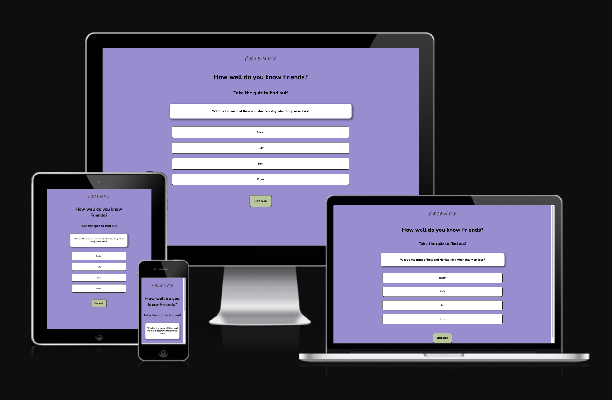
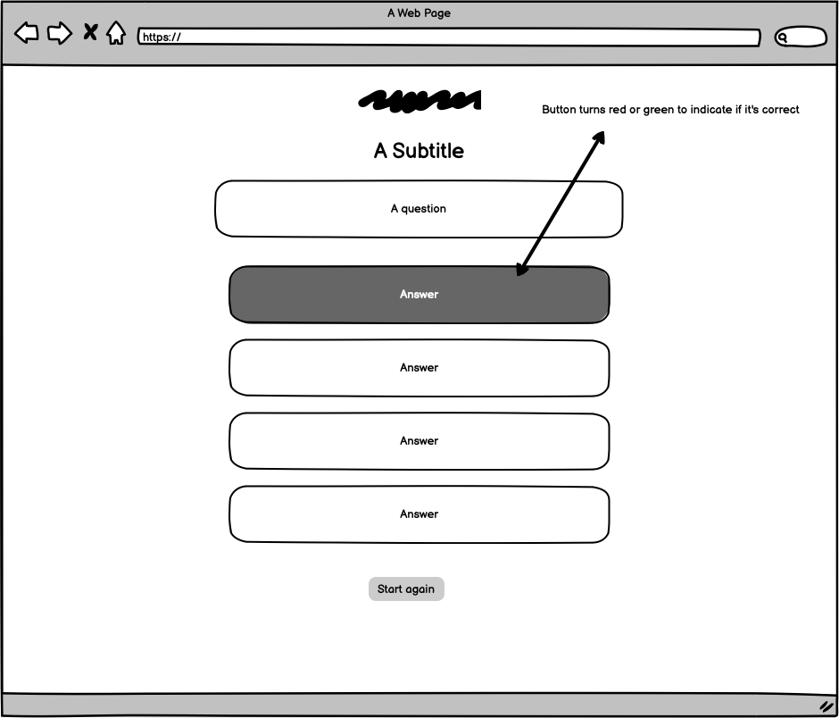
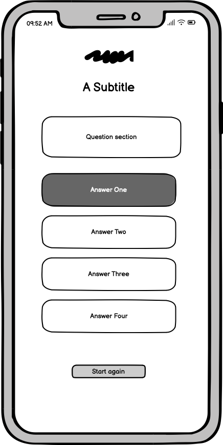
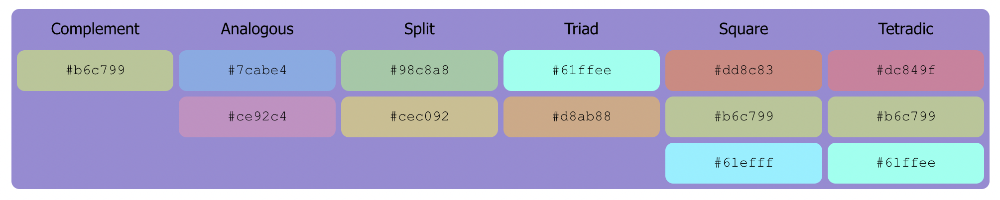
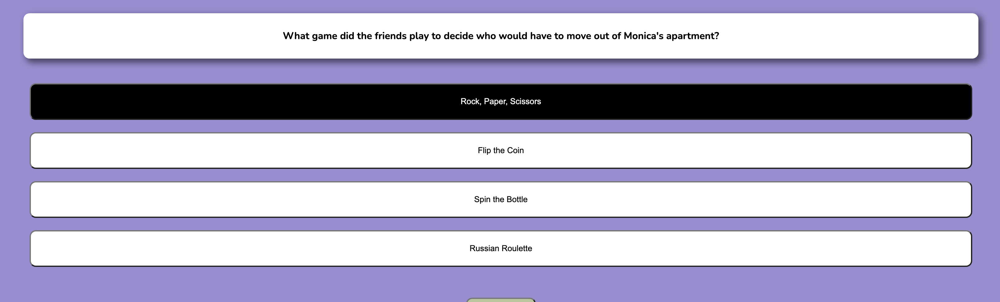
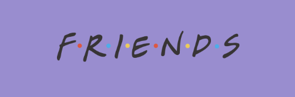
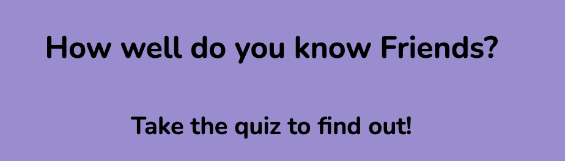
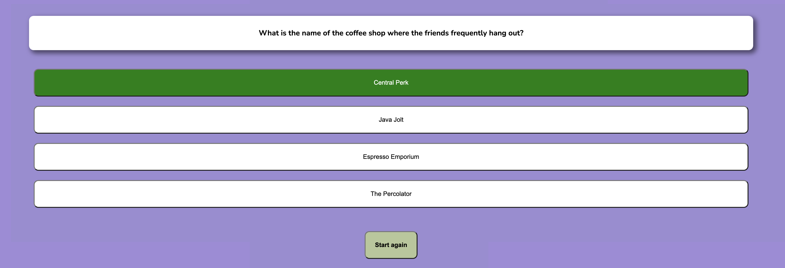
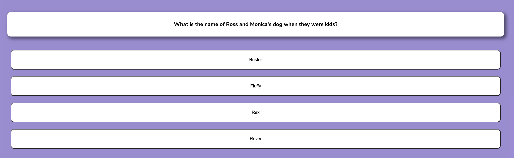
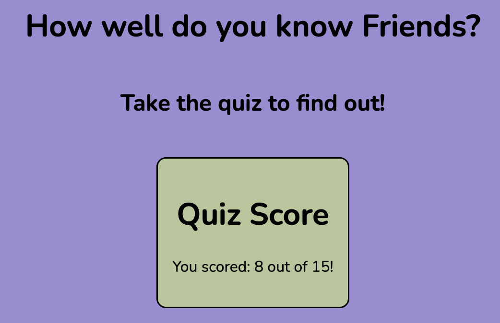

# Friends Quiz

Friends Quiz is a responsive quiz for lovers of the tv show, "Friends". It is designed for die hard fans to test their knowledge with a set of interactive multiple choice questions, using Javascript. At the end of the quiz, the user is provided with a score out of ten, and has the option to retake the quiz. The site is intended to be used for trivia, for the users enjoyment.

# UX

The site's intended users are customers, who are fans of the tv show ‘Friends’. The site is designed to be fun and entertaining, while providing some factual content.

## User stories

- As a user, I want to navigate this website with ease and simplicity
- As a user, I want to see how well I can do on the quiz
- As a user, I want to test my knowledge
- As a user, I want to be able to see how many questions I answer correctly
- As a user, I want to be able to restart the quiz and beat my score

## Strategy

The intent of the website is to deliver a fun and informative quiz in a visually pleasing manner. This information will solve a problem for the user, such as the need for entertainment. The goal is to elicit a positive response in the user

## Scope

The features required to meet the user needs include:

- A brief introduction to the quiz and what to expect
- A clearly positioned question
- An answer section with the functionality to select one of the answers from multiple choices
- A clear indication as to whether they have answered correctly
- A score out of 15 at the end of the quiz
- A refresh function that allows the user to start the quiz again

## Structure

- **One home/landing page**
- **Heading section**  that briefly describes what the page is for
- **Question section** that separates a question from the rest of the page using a box
- **Answer section** with four multiple choice answers separated clearly as individual buttons
- **Restart button** that allows the user to refresh the page and restart the quiz

## Skeleton

The website uses a sequential structure, based on one web page. This page was designed first in Balsamiq, which allowed for the layout to be loosely designed for different screen sizes beforehand

## Surface

 
A background colour of lilac was used to remind the user of the tv show, as this colour is repeated throughout the show. This is accented with a contrasting colour of green. Dark and light colour tones are used in contrast to make text stand out against background colours. This makes the site more accessible for the user. The buttons are clearly defined from the background. 

The hover function over the buttons (on devices that support this option) makes the quiz easier to navigate. Buttons turn black as you pass over them, as well as the cursor appearance changing.

## Features

### Existing Features

- **The Friends logo**

  - Featured at the top of the page is the "Friends" logo. This is immediately recognisable to the user and synonymous with the brand.

- **The Heading and Subheading**

  - This section explains what the user is seeing below, by introducing the quiz, and challenging them to take part. It automatically guides the user down the page.

- **The Quiz Section**

  - This section comprises of a question box and four multiple choice answers below each question. As the user hovers over the answers with their mouse, each will be highlighted.
  - The user will be able to submit their answer and the button will temporarily turn green or red depending on the user entering a correct or incorrect answer.
  
  - The quiz will then automatically generate the next question after a period of a few seconds

- **Score Container**

  - This section is only visible at the end of the quiz, once the user has answered all the questions
  - User score is calculated

- **Restart Button**

  - This section has a button specifically to allow the user to restart the page, for instance if they want to beat their own score.
  - When the user presses the button, the quiz is refreshed so that the first question is shown again.

### Features Left to Implement

- In the future there is potential to add levels to the quiz, so once the initial 15 questions are answered, the user has the option to proceed onto level 2, and work through another set of questions. This would keep the user on the page longer, and even encourage them to revisit the page again another time. The questions could be updated regularly to increase the challenge.
- A timer function could be implemented to make the game more exciting
- User details could be taken so that all messaging to the user is personalised ie. when the score is delivered at the end, a name could also be included

## Testing

- I tested playing the game on different browsers e.g. Chrome and Safari
- I have run through both correct and incorrect answers to see that the correct colours are displayed on the buttons
- I have tested that the hover function works on devices where this is enabled, and that it is disabled on touch screen devices
- I have confirmed that the colour contrast is accessible and easy to read using webaim.org
- I have confirmed that the game looks good on different screen sizes, from phone size, tablets to laptops and larger screens

## Validator Testing

- No errors were found in the HTML when testing with the official W3C Validator [HTML Validator](assets/images/html-checker.png)
- No errors were found in CSS when testing with the official Jigsaw validator [CSS Validator](assets/images/w3c-validator.png)
- No errors were found in Javascript when testing with JSHint JavaScript Validator [JShint Validator](assets/images/jshint.png)

## Bugs

### Solved Bugs

While testing the game on iPhone, I realised that the hover function on the buttons was malfunctioning. I realised after some searching online that this was a common problem with touch screen devices. The buttons remained highlighted after a user pressed on it, even once the game had moved onto the next question. I have resolved this problem by using a media query, so that the hover effect now only works on hover enabled devices.

## Deployment

The site was deployed in Github, using the following steps:

- Under the repository name, click settings
- Under the code and automation section, click 'pages'
- Underneath 'build and deployment', under 'source', make sure 'Deploy from a branch' is selected
- Under the 'branch' section, select 'main' and 'root', and click 'save'

The live link is located here - [Friends Quiz](https://katiecampbs.github.io/friendsquiz/)

## Credits

- The code detailing the media query which was used to fix the hover bug mentioned above, was taken from [this](<https://www.geeksforgeeks.org/how-to-prevent-sticky-hover-effects-for-buttons-on-touch-devices/>) website
- [This](https://developer.mozilla.org/en-US/docs/Web/JavaScript/Reference/Statements/import) website was referenced in order to understand importing variables from another javascript file
- The questions and answers were generated using [CHAT GPT](https://chat.openai.com/)
- The ‘Friends’ logo is from [this](<https://freebiesupply.com/logos/friends-logo/>) website
- Favicon created using [Favicon.io](https://favicon.io/favicon-generator/)
- Medale Oluwafemi, my mentor, for reviewing the project and troubleshooting with me ([Github](https://github.com/omedale))
