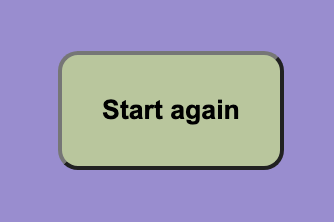

# Friends Quiz

Friends Quiz is a responsive quiz for lovers of the tv show, "Friends". It is designed for die hard fans to test their knowledge with a set of interactive multiple choice questions, using Javascript. At the end of the quiz, the user is provided with a score out of ten, and has the option to retake the quiz. The site is intended to be used for trivia, for the users enjoyment. 

## Features 

### Existing Features

- __The Friends logo__

  - Featured at the top of the page is the "Friends" logo. This is immediately recognisable to the user and synonymous with the brand.

- __The Heading and Subheading__

  - This section explains what the user is seeing below, by introducing the quiz, and challenging them to take part. It automatically guides the user down the page. 

- __The Quiz Section__

  - This section comprises of a question box and four multiple choice answers below each question. As the user hovers over the answers with their mouse, each will be highlighted.
  - The user will be able to submit their answer and a pop-up will make it known to the user if they answered correctly. The quiz will then automatically generate the next question when the user clicks okay.

- __Restart Button__

  - This section has a button specifically to allow the user to restart the page, for instance if they want to beat their own score.
  - When the user presses the button, the page is refreshed so that the first question is shown again. 

### Features Left to Implement

- In the future there is potential to add levels to the quiz, so once the initial ten questions are answered, the user has the option to proceed onto level 2, and work through another set of questions. This would keep the user on the page longer, and even encourage them to revisit the page again another time. The questions could be updated regularly to increase the challenge.
